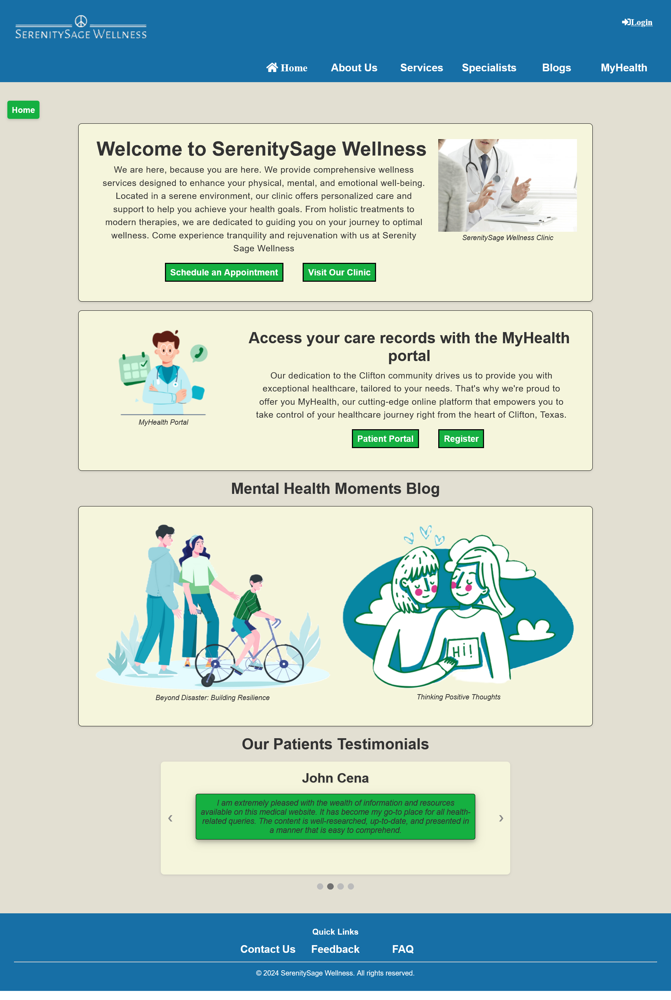
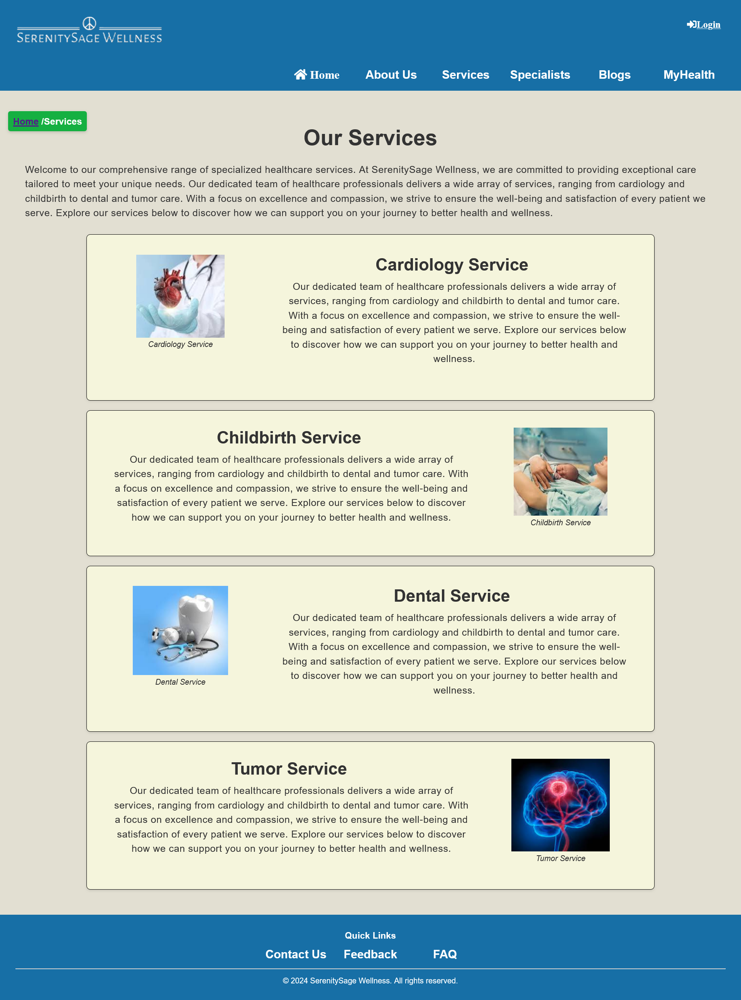
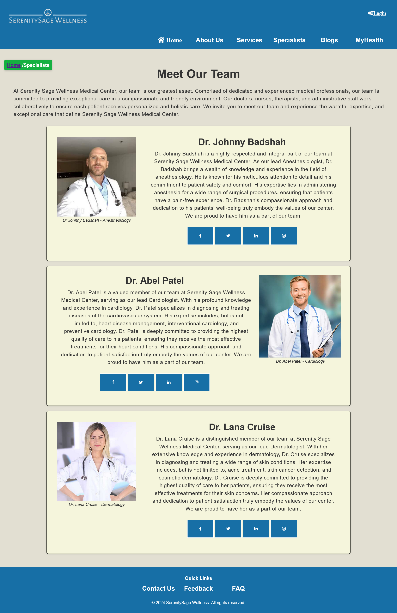
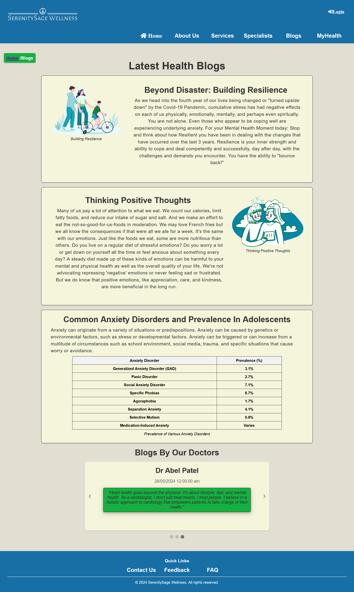
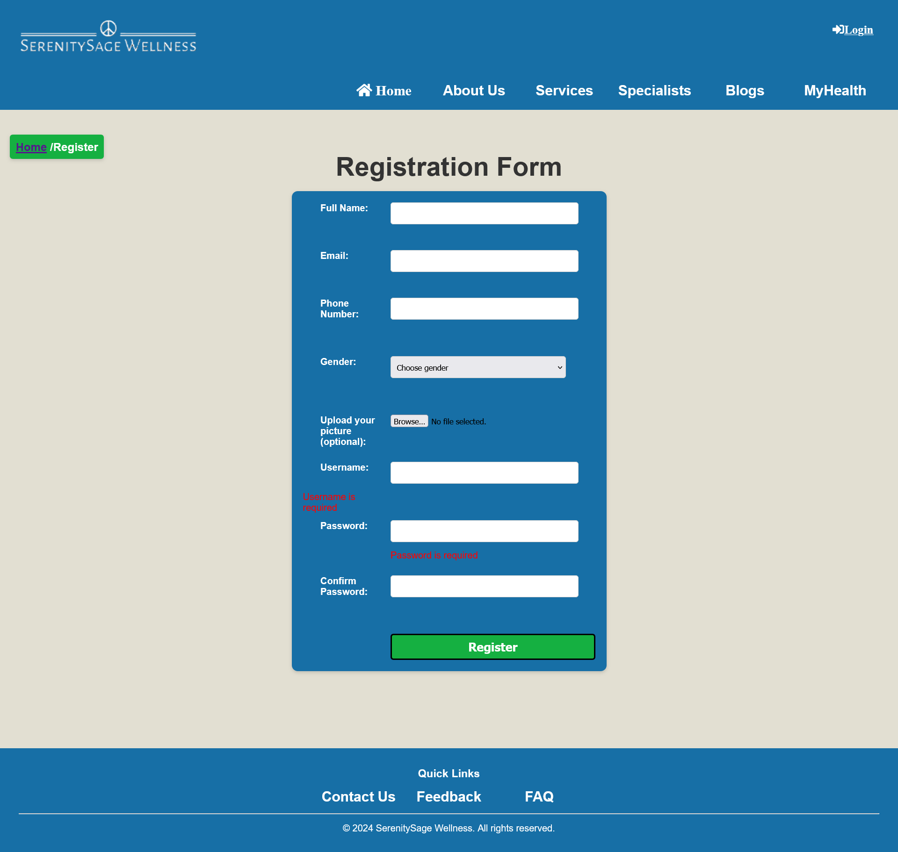
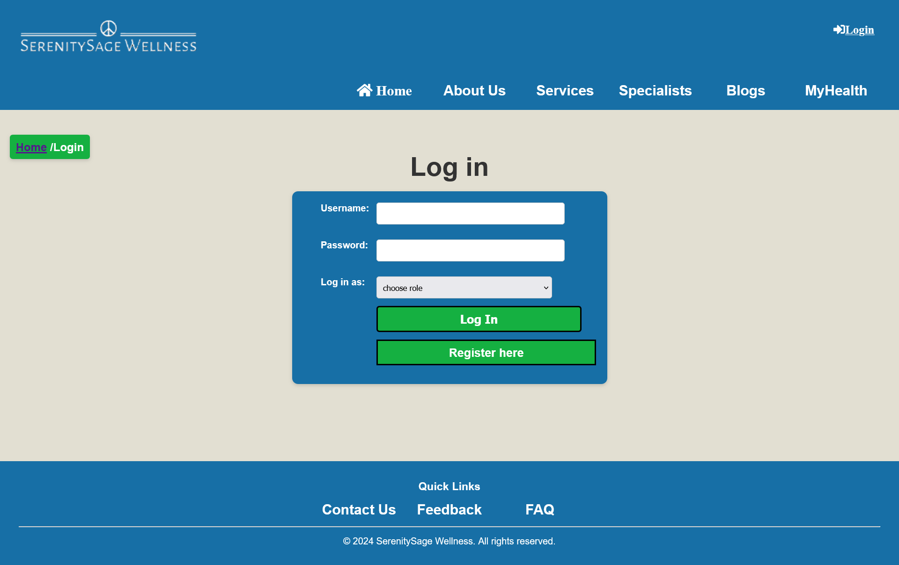
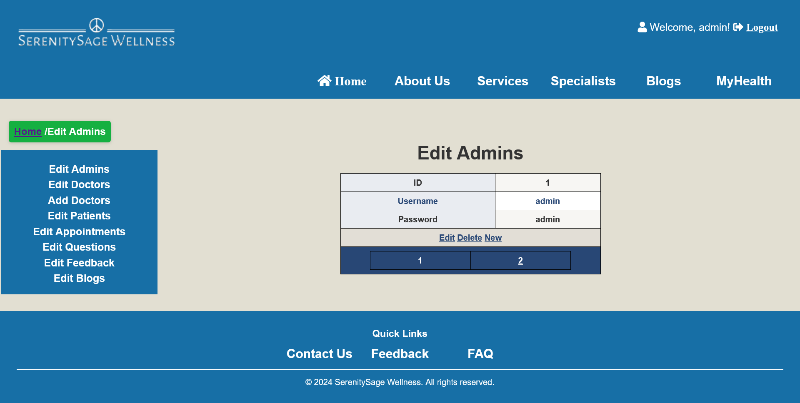
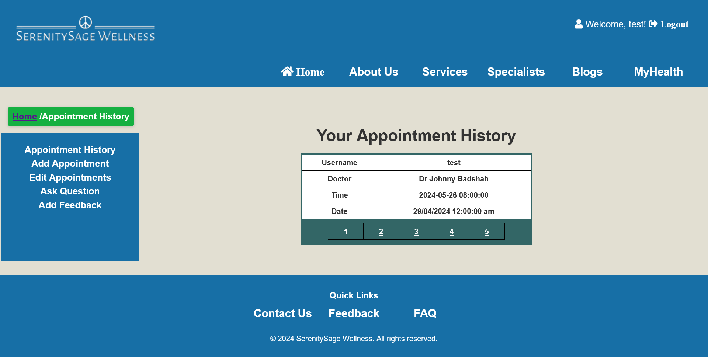
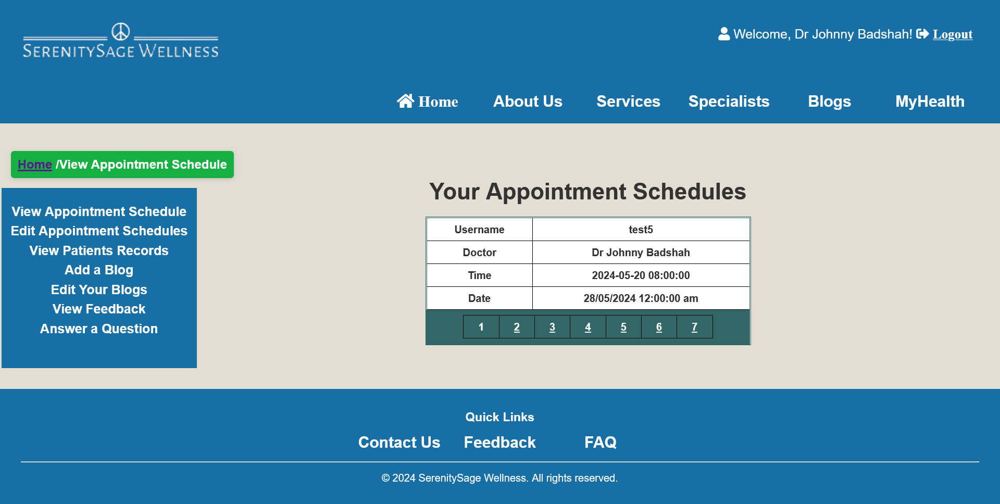

# Medical Portal Website

## Overview

This website provides a medical portal with three main user roles: **Patients**, **Doctors**, and **Admins**. The system is dynamically generated from a database and allows patients to ask health-related questions, which doctors can respond to. Doctors can also add blogs, which are displayed in a slideshow, and the website features a feedback section for user engagement.

## How to View This Website

To run and view the website, follow these steps:

1. **Download the code** from the repository.
2. **Unzip the folder** to extract the project files.
3. Open **Web Developer 2010**.
4. Open the folder where the unzipped code is located.
5. Press **Debug** to run the website on your local server.

## User Roles

The system has three distinct user roles, each with different functionalities:

1. **Patient**  
   - Patients can ask questions to doctors.
   - Patients can view blogs posted by doctors.
   
2. **Doctor**  
   - Doctors can respond to patient questions.
   - Doctors can add blogs that are shown as a slideshow on the homepage.
   
3. **Admin**  
   - Admin users can manage the platform, including content moderation and user management.

## Features

- **Dynamic Database Integration**: All content, including blogs and questions, is dynamically managed from the database.
- **Blog Slideshow**: Blogs posted by doctors are shown in a responsive slideshow on the homepage.
- **Feedback Section**: Users can leave feedback, enhancing the interactive experience.

## Screenshots

Below are the main screens from the website:

### 1. Home Page

### 2. Our Service 

### 3. Our Team 

### 4. Our Blogs 

### 5. Sign Up

### 6. Sign In

### 7. Admin Dashboard

### 8. Patient Dashboard

### 9. Doctor Dashboard

